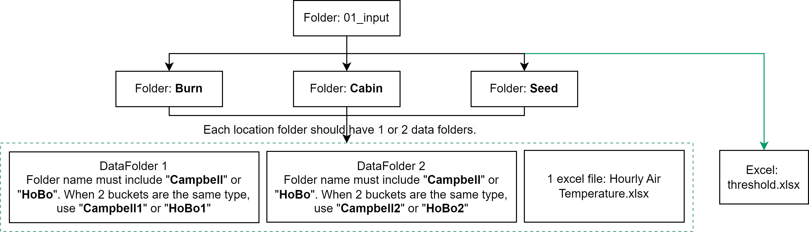
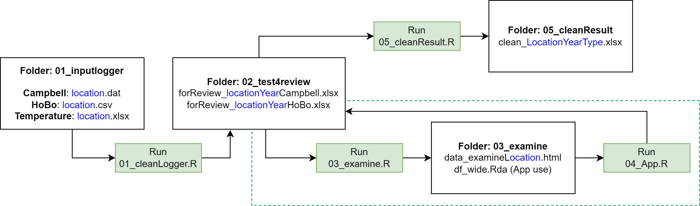
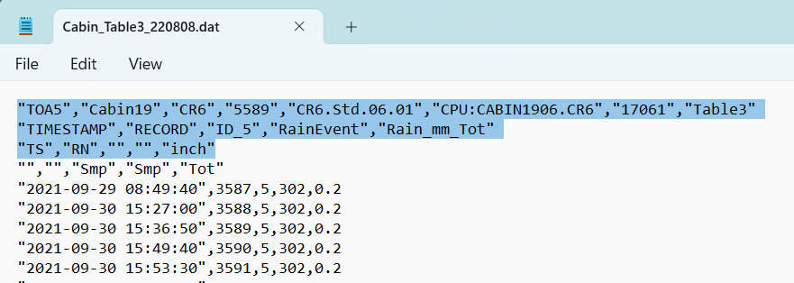
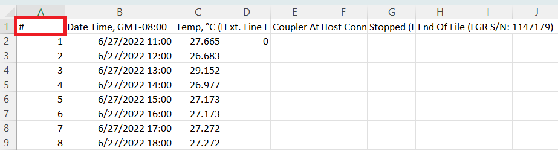
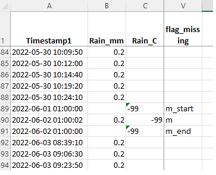

# Scope
This project helps users to conduct quality control activities on tipping bucket rain gauge data. 

> The workflow and scripts developed are tailored to be used only by the Kootenay Boundary research team within the Ministry of Forests for data coming from the West Arm Demonstration Forest tipping bucket rain gauges. Use by other projects may be possible, but generalization of the data handling systems may be required. 
  
  
# R Project Structure

The project is organized in a way to support the QAQC process for the tipping bucket rain gauge data from the West Arm Demonstration Forest.  

  -   **tbrg-qc.Rproj** - Double-click this file to initialize the project in RStudio.
   
  -   **00_scripts** folder:
      +   **01_cleanLogger.R** Reads logger data from the **01_input** folder and generates Excel files in the **02_test4review** folder.  
      +   **03_examine.R**     Reads Excel files from the **02_test4review** folder and generates HTML reports and datasets in the **03_examine** folder.  
      +   **03_examine.Rmd**   This file is called in *03_examine.R* and contains templates for HTML reports. Please do not run this file manually.  
      +   **04_app.R**        (This script is actually put in the project root folder.) This is a Shiny App that displays a cumulative rainfall plot. Please run this after running the *03_examine.R* script, which generates the `df_wide.Rda` data that this Shiny App uses.
      +   **05_cleanResult.R** Reads Excel files from the **02_test4review** folder and generates final cleaned data Excel files in the **05_cleanResult** folder.  
      +   **functions.R**      This file is referenced by other scripts. Please do not run this file directly.
   
  -   **01_input** folder:  
 
      -   **threshold.xlsx**    This file contains the settings for the data QAQC process, and should be checked carefully before starting the workflow. 
      -   **Location Name folder**   Each folder should be named after a location, and contains the following subfolders and files:
          -   **Temperature_anyname.xlsx** Excel file containing hourly temperature data. Each location folder should contain only one Excel file.
          -   **Data Folder 1** Folder name should contain the keyword **Campbell** to indicate Scientific data logger data, or the keyword **HoBo** to indicate the HoBo logger data. All files in one data folder will be combined into a single output file. 
          -   **Data Folder 2**  Same naming rules as **Data Folder 1**. 
      If you have 2 sets of Campbell (or HoBo) data for a location, please create folders named "Campbell1" and "Campbell2" under the location folder. Then, put the .dat files from one bucket into one folder. The script will read the folder names to identify the data type.
      If you only have 1 bucket at a location, create one data folder under the location folder. All scripts will work.

  -   **02_test4review** folder: This folder contains output files that reviewers can open to review the data. Reviewers may rerun the 03_examine.R script as many times as necessary to review the data. Make sure to close all Excel files before proceeding to the next step.
  
  -   **03_examine** folder: This folder contains HTML reports on the quality of the input data, generated by the 03_examine.R script.
  
  -   **05_cleanResult** folder: This folder contains the final clean result, with Excel files generated by the *05_cleanResult.R* script.

# Workflow  
The overall workflow, and interrelation between R scripts and folders in this solution is shown in the following figure:
  
 
   

# Input data formats  
  
This section explains the format requirement for the files in the **"01_input"** folder.  
  
## threshold_value.xlsx  
This Excel file has four sheets, each with a note column that explains the format requirement. Please modify the green-shaded cells for the settings.  
  -   **extreme**   The values in this table set up the tests in folder 02_test4review.  
  -   **GOF**   Each location should have a start time and end time for goodness-of-fit (GOF) evaluation.  
  -   **examine**   Each location-bucket (also called data_type in the scripts) should have a start and end time indicating when the tipping rain bucket gauge was installed.  
  -   **missing**   Copy from the table "missing data summary". Missing periods will be read in the first step - script *01_cleanLogger.R*, and can be added in the **02_test4review** Excel files. (See section [Modify missing period])  

## Hourly Air Temperature Files
The file name must include the station location name.  
Each file must have a column `DateTime` indicating the timestamp, and a column `Tair_Avg_C` indicating the temperature in degrees Celsius.  
  
## Raw Campbell Scientific Files  
When the script reads in the Campbell logger data, the first three rows will be skipped. The column `Tot` will be read as the rain data. The example below shows the required format of the data files.
(R code can be found in `functions.R`, and `01_cleanLogger.R` lines 91-101.)

   
  
## Raw HoBo Files  
When the script reads the HoBo csv data file, the first row will be skipped. The columns are renamed, and only the second and fourth columns will be selected.
(R code can be found in `functions.R`, and `01_cleanLogger.R` line 108-117.)
> Please clean the 1st column and 1st row as shown in the screenshot given below.

 

  
# Modify Missing Data Periods
When you add _missing data periods_ to the Excel files in the **02_test4review** folder, please include a start and end time for each period, flagged with `m_start` and `m_end`, respectively. The rows between the start and end times should be flagged with `m` to indicate missing data.
   
 
  
  
# Data Review Table Column Explanation
  
The table below explains the columns in the Excel files in the **02_test4review** folder.  
  

 `forReview` table columns meaning (click to unfold) 

  
| Column name |  Meaning |
|:------|:------------------------|  
|Timestamp1       | Timestamp for rain tip. No replica for Campbell data.|
|Rain_mm          | Original rain data from the logger in mm.|
|Rain_C           | Reviewers put new rain values in this column. Put `-99` for **MissingPeriod** and add flags in the `flag_missing` column. |
|flag_missing     |Indicating bucket malfunction. Each missing period should be a period with a row having a value of `m_start` and another row having a value of `m_end` (rows inbetween should flagged as `m`). When the missing flag is used, the `Rain_C` column value should be `-99`. The missing flags will be read from the threshold table automatically, and reviewers can add flags in this column manually.  |
|flags            | A summary of all flags in this row.|
|Temperature_hobo | Only HoBo data has this column. Temperature value read from HoBo logger. |
|TimestampH       | Timestamp floored to the hour.|
|Tair_Avg_C       | Air temperature read from the `Hourly Air Temperature` table. |
|event2h          | Numbered rain event. Tips that have a time gap more than 2 hours are considered as another rain event. |
|gap              |Time gap between this tip and the previous one, in seconds. |
|flag_tip         |Shown as flags `Y` when Campbell tip >=0.6 or HoBo tip is not equal to 0.254 |
|flag_instantaneous| Within each event, flag when 2 tips have a tiny time gap that indicates hourly rain may exceed the instantaneous rain threshold. Falsely flagged for some HoBo data which have the same timestamp. |
|gap_increase     |Within each event, flagged as `1` when the time gap increased and flagged as `0` for not increased.  |
|gap_ins_ct       |Numbers increase by 1 if the time gap kept increasing. Used for the `flag_prolong` column. |
|flag_prolong     |If the time gap between 2 tips have been increased for at least 12 times, they will be flagged as `prolong`. |
|i_hrmax          |Hourly sum rain value. Hour means clock time. |
|flag_hrmax       |Flagged as `hrmax` if the rain tips indicate that it will exceed hourly max threshold value.  |
|i_daymax         |Daily sum rain value. Day means calendar day. |
|flag_daymax      |Flagged as `daymax` if the rain tips indicate that it will exceed daily max threshold value.  |
|flag_below0      |Flagged as `below0` if temperature < 0.   |
|flag_SM4         |If the temperature was ever < 0 during 00:00 ~ 15:00 and > 0 between 12:00 ~ 15:00, all tips in that day will be flagged as `SM4a`. |

  

  

`End`